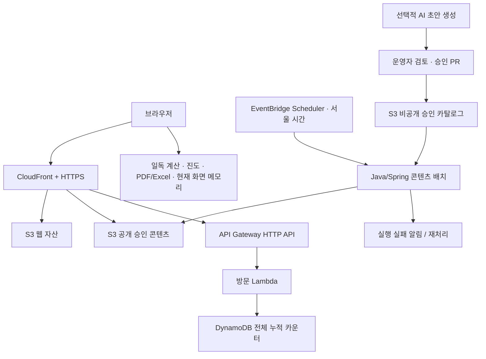

# 말씀하루 백엔드·운영 아키텍처 계획

- 작성: 2026-09-27
- 상태: 현재 저장소를 조사한 구현 제안. 이 문서 작성으로 AWS 배포·도메인 구매·LLM 호출을 실행하지 않는다.
- 적용 범위: 현재 한국어 프론트엔드, 매일 구약/신약 말씀과 해설, 일독 계획·진도·파일 추출, 사이트 전체 누적 방문수.
- 우선순위: 이 문서는 기존 구현 계획의 QT 수집 중심 구조, 영어 지원, 비용 가정을 최신 화면에 맞춰 보완한다. 구현 사실과 후속 작업을 구분한다.

## 1. 추천: 정적 배포 + Java/Spring 서버리스 배치 + 작은 방문 API

현재 제품은 모든 방문자에게 같은 말씀을 제공하고, 개인 일독 계산은 브라우저에서 끝난다. 따라서 **S3/CloudFront로 화면과 말씀을 제공하고, Java 21 + Spring Cloud Function으로 매일 콘텐츠를 준비하는 서버리스 구조**를 첫 운영안으로 추천한다. 기존 방문 카운터 Node Lambda는 유지하면서 전체 누적 계약을 바로잡는다. Java로 옮기는 일은 여러 사용자 API가 필요해질 때 진행한다.

Java/Spring과 서버리스는 양자택일이 아니다. Spring의 서비스·검증·저장소 구조를 사용하면서 실행을 Lambda가 맡을 수 있다. 단일 책임 배치에는 Spring Cloud Function이 맞고, 여러 MVC API가 생기면 Spring Boot 컨테이너 또는 Lambda용 서버리스 컨테이너 어댑터를 재검토한다. [Spring 공식 AWS 어댑터 설명](https://docs.spring.io/spring-cloud-function/reference/adapters/aws-intro.html)

| 선택 | 현재 서비스 적합도 | 장점 | 비용·운영 부담 | 선택 시점 |
| --- | --- | --- | --- | --- |
| 서버리스 + 정적 콘텐츠 | **첫 출시 추천** | 조회가 빠르고 배치 실패가 기존 콘텐츠·계획에 영향을 적게 줌 | 호출·전송·저장 요금, IAM·이벤트 중복 이해 필요 | 현재 |
| EC2 1대 + Spring Boot | 대안 | 익숙한 MVC, Linux/Docker 배포 학습 | 인스턴스 상시 비용, EBS·IPv4·백업·패치, 단일 장애점 | 서버 운영 학습 자체가 우선이거나 지속적인 동적 요청 증가 |
| ECS/Fargate + Boot | 후속 후보 | 컨테이너 운영과 확장 | 상시 태스크·로드밸런서 등 기본 비용 | 로그인·저장·관리 기능과 트래픽 증가 |
| 여러 Spring Cloud 서비스 상시 운영 | 현재 과함 | 서비스 간 통신·장애 격리 학습 | Gateway·서비스·DB·관측성 운영 비용 증가 | 독립 배포할 도메인과 팀 경계가 실제로 생긴 뒤 |

Lambda 비용은 요청과 메모리×실행 시간에 비례한다. EC2는 가동 시간에 따라 과금되며 주변 자원도 함께 계산해야 한다. 이 차이와 현재의 낮은 동적 처리량을 근거로 서버리스를 추천한다. [Lambda 요금](https://aws.amazon.com/lambda/pricing/), [EC2 요금](https://aws.amazon.com/ec2/pricing/on-demand/)

### 한 대에 모두 올릴 때의 실제 비용 비교

한 대의 VM에 Caddy/Nginx로 React 정적 파일을 제공하고, Spring Boot와 로컬 SQLite를 함께 실행하는 설계도 타당하다. 이 경우 **DynamoDB·API Gateway·S3·CloudFront는 필수가 아니다**. 지금처럼 저장할 것이 전체 누적 방문수 한 건뿐이라면 MySQL/PostgreSQL 대신 SQLite가 더 단순하다. 이 설계에서는 Spring이 날짜별 말씀 JSON을 로컬 디스크에서 읽고, 일독·PDF/Excel 계산은 계속 브라우저가 맡는다. 서버 디스크의 카운터와 승인 말씀 파일은 별도 백업·복구가 필요하다.

| 비교 예시 | 월 고정비/사용량 | 1만 원 목표와 관계 |
| --- | --- | --- |
| 한 대 Lightsail 0.5GB | IPv4 포함 표기가 월 $5; 예시 환율 1,560원/$·부가세 10% 적용 약 8,580원 | 예산 안에 들어갈 수 있지만 Java 21 Spring + OS + 웹서버 + DB를 0.5GB에 안정적으로 넣을 수 있다는 근거는 없음. 메모리/스왑/재시작 실측 필요 |
| 한 대 Lightsail 1GB | 월 $7, 같은 환율·세금으로 약 12,012원 | 도메인·스냅샷 전부터 1만 원 초과. Spring + SQLite는 제한된 힙으로 시험 가능 |
| 한 대 Lightsail 2GB | 월 $12, 같은 환율·세금으로 약 20,592원 | Spring + SQLite/MySQL의 메모리 여유가 늘지만 목표 초과 |
| 일반 EC2 1대 | 인스턴스 시간 요금 + EBS + public IPv4($0.005/시간, 730시간이면 $3.65) + 전송·백업 | 서울 리전 인스턴스 가격·크기와 무료 체험 자격 확인 전 총액 확정 불가 |
| 현재 카운터 DynamoDB on-demand | 저장 항목 1개, 페이지 로드마다 작은 쓰기 1회. 저장소에 기록된 2026-09-24 서울 단가 $0.68/백만 WRU라면 3만 쓰기 약 $0.0204, 예시 환율·세금으로 약 **35원** | DB 자체에는 서버 월 고정비가 없음. API Gateway·Lambda·CDN·S3·도메인은 별도 합산 필요 |

Lightsail 공개 가격은 [AWS Lightsail 요금](https://aws.amazon.com/lightsail/pricing/), EC2 IPv4 가격은 [AWS VPC 요금](https://aws.amazon.com/vpc/pricing/), DynamoDB 과금 방식은 [AWS DynamoDB 요금](https://aws.amazon.com/dynamodb/pricing/)에 따른다. DynamoDB 35원은 **계정의 다른 요청·스토리지·무료 구간·요금 변동을 제외한 3만 건의 1KB 이하 일반 쓰기만** 계산한 예시다. API Gateway를 같은 3만 회 호출하고 저장소의 서울 단가 $1.23/백만 요청을 적용하면 약 $0.0369(같은 환율·세금으로 약 63원)가 더해진다. Lambda 등은 별도다. 가격 파일은 과거 스냅샷이므로 배포 직전 다시 조회한다.

따라서 'DB를 서버에 깔면 무조건 최저가'도, 'DynamoDB를 쓰면 전체 비용이 반드시 최저가'도 아니다. **서버가 이미 다른 용도로 켜져 있거나 1GB 한 대 운영을 원한다면 Spring + SQLite 통합 배포가 경제적일 수 있다.** 새 서버를 이 서비스 때문에 상시 켜야 하고 월 1만 원을 유지한다면 현재 트래픽 가정에서는 정적 CDN + 작은 방문 API가 유리하다. 반대로 페이지 로드가 매우 많고 이미지 전송이 CloudFront 무료 범위를 넘으면 다시 계산한다. 서비스가 계속 커지면 동적 처리량과 운영 시간을 실제 측정해 비교한다.

AWS는 2026-12-31까지 t4g.small의 월 최대 750시간 무료 체험을 [안내](https://aws.amazon.com/ec2/instance-types/t4/)한다. 계정·리전 자격과 별도 IPv4/EBS 비용을 확인해야 하며, 이 기간 한정 혜택을 영구 운영비 계산에 넣지 않는다.

## 2. 현재 코드와 차이

| 영역 | 확인한 현재 상태 | 이 계획의 조치 |
| --- | --- | --- |
| 말씀 조회 | `web/src/app/dailyWord/loader.ts`에서 `/daily-word/YYYY-MM-DD.json` 조회, 날짜·스키마 검증 | 경로·응답 계약을 유지하고 공급 자동화 |
| 말씀 자료 | `web/public/daily-word`에 9월 26일·27일 파일 | 두 날짜의 파일 존재는 매일 자동 공급을 뜻하지 않음. 승인 카탈로그와 배치 추가 |
| QT 교재 | 공식 페이지로 이동 | 매일성경·생명의삶·날마다 솟는 샘물 링크 유지. 매 요청 크롤링 불필요 |
| 기존 Java QT | `services/qt`, 수집/조회 Lambda·테이블 IaC | 레거시 선택 기능으로 격리, 신규 운영 스택 기본 배포에서 제외 |
| AI | `services/ai`는 WEB 기반 골격 | 개역한글 설명 계약으로 명시적으로 전환한 뒤 내부 초안 생성기에 활용 |
| 일독·진도 | `web/src/domain` 순수 계산, 개인 데이터 비저장 | 같은 구조 유지. 서버가 계획을 저장하거나 계산을 중복 구현하지 않음 |
| 추출 | `web/src/export`의 Excel/PDF/인쇄 | 브라우저 내 생성 유지 |
| 방문수 | 실제 Lambda와 Vite 미들웨어가 `daily#날짜` 기준으로 초기화 | 사용자가 명시한 **사이트 전체 누적**과 불일치. P0 수정 항목 |
| 배포 | CDK 초안, GitHub Actions CI, CD 없음 | OIDC 기반 CD 추가 계획. 실제 배포 여부는 AWS에서 별도 확인해야 함 |
| 콘텐츠 배포 | 웹 산출물과 같은 S3 루트에 날짜 JSON 포함 | 웹 배포와 자동 콘텐츠의 소유권 분리. 웹 배포가 배치 파일을 지우지 못하게 함 |

## 3. 운영 구성



- AWS 실행 리전 제안은 서울(`ap-northeast-2`). CloudFront 인증서는 `us-east-1`에 발급한다. DNS 공급자는 도메인 등록업체와 달라도 된다. [CloudFront 인증서 요구사항](https://docs.aws.amazon.com/AmazonCloudFront/latest/DeveloperGuide/cnames-and-https-requirements.html)
- 웹 버킷, 공개 승인 콘텐츠 버킷, 비공개 카탈로그/초안 버킷의 쓰기 권한을 구분한다. S3 public access는 차단하고 공개 콘텐츠도 CloudFront OAC를 통해서만 읽는다.
- `/daily-word/*`는 콘텐츠 버킷, `/api/visits`는 HTTP API, 나머지는 웹 버킷으로 라우팅한다. JSON의 403/404를 SPA HTML로 바꾸지 않는다.
- 배치와 API는 처음에는 VPC 밖에서 실행한다. RDS, NAT Gateway, Redis, Kafka, Eureka는 P0 구성에 넣지 않는다.
- CDK를 계속 사용한다. Java는 도메인 코드, TypeScript는 기존 인프라 정의와 프론트엔드를 맡는다.

## 4. Java/Spring 코드 경계

신규 `services/daily-content/` 하나를 모듈 구조로 시작한다. 모든 폴더를 독립 서비스로 배포하지 않는다.

```text
domain/            VerseCandidate, ApprovedExplanation, DailySelection
application/       SelectDailyWord, PublishDailyWord, CheckContentCoverage
port/              CandidateCatalog, ContentStore, ExplanationDraftProvider
adapter/s3/        비공개 승인 자료 읽기·공개 JSON 쓰기
adapter/lambda/    Spring Cloud Function 진입점
adapter/local/     같은 서비스 로직을 실행하는 로컬 명령
```

기본 입력은 `targetDate`, `poolVersion`, `algorithmVersion`. `Clock`과 저장소는 주입하며 함수 초기화 시점에 오늘 날짜나 난수를 고정하지 않는다. 서버리스 배치는 예약된 목표 날짜로 실행해 자정을 넘긴 재시도에도 다른 날짜를 생성하지 않는다.

기존 Java 21·Spring BOM을 출발점으로 의존성 호환성을 검증해 고정한다. 배치는 요청 지연에 민감하지 않아 콜드 스타트를 허용한다. 방문 API까지 Java로 옮길 경우에는 메모리별 기동·응답 시간을 측정한 뒤 SnapStart를 적용한다. 공식 문서상 **Java managed runtime의 SnapStart에는 별도 SnapStart 요금이 없다**. 기존 비용 문서의 Java에도 캐시 고정비를 부과한 가정은 수정 대상이다. 스냅샷의 날짜·난수·연결 재사용도 점검한다. [SnapStart 조건·요금](https://docs.aws.amazon.com/lambda/latest/dg/snapstart.html)

## 5. 매일 말씀 공급

### 5.1 선택할 데이터

1. 개역한글 본문 자료의 출처·재배포 조건·파일 해시·책/장/절 대응을 기록한다. UI의 간단한 `개역한글` 표기와 내부 출처 관리 기록은 별개다.
2. 후보는 구약/신약으로 나누고 구절 ID 중복을 제거한다. 선택 후보마다 정확한 본문과 승인된 해설이 있어야 한다.
3. 초기에 충분한 승인 후보를 확보한다. **각 후보가 동일 확률인 승인 풀 추출**을 기본으로 한다. 성경 전체 절을 후보로 확대하려면 전체 본문 검증과 모든 선택 결과에 대한 해설 공급 방안이 먼저 필요하다.
4. 선택 원리 팝오버의 분모는 실제 활성 풀 크기를 사용한다. 전체 구약·신약 절 수를 검증 없이 표시하지 않는다.

### 5.2 하루에 모두 같은 두 절

- `Asia/Seoul` 날짜와 고정된 `poolVersion`, `algorithmVersion`, OT/NT 구분값으로 재현 가능한 선택을 만든다. Java 표준 해시를 기반으로 한 rejection sampling 등 편향 없는 인덱스 변환을 사용한다.
- 최초 실행에서 해당 날짜가 사용할 풀 버전을 고정한다. 그날 카탈로그가 변경되어도 재시도가 다른 본문을 뽑지 않는다.
- 구약과 신약을 독립 추출한다. 각 후보 확률은 각각 `1 / OT 후보 수`, `1 / NT 후보 수`다. 일간 반복은 허용한다. 최근 30일 제외 규칙을 추가하면 분모·확률 설명·선택 알고리즘을 함께 변경해야 한다.
- 사용자 방문, 새로고침, 낮/밤 모드 전환으로 본문이 바뀌지 않는다. 추출기는 브라우저가 아니라 배치에서만 실행한다.

### 5.3 미리 준비하고 예약 발행

- 운영 목표는 **최소 7일, 권장 14일분**의 승인된 날짜별 콘텐츠를 비공개 저장소에 확보하는 것이다. 풀에서 이미 검토한 본문과 해설을 조합하므로 매일 LLM 호출이 필수는 아니다.
- 매일 21:10 KST에 이후 14일 준비 상태를 확인·보충한다. 매일 00:00 KST에 당일 자료를 발행한다. Scheduler의 시간대는 `Asia/Seoul`, flexible time window는 끈다. 정확한 초 단위 실행을 보장한다고 표현하지 않는다. [Scheduler 시간대·일정](https://docs.aws.amazon.com/scheduler/latest/UserGuide/schedule-types.html)
- 준비 작업은 승인된 후보만 사용한다. 미래 날짜 파일은 비공개에 두고 공개 버킷에는 발행 시점에 복사한다. 관리 UI 없이 콘텐츠 PR과 승인 manifest로 시작한다.
- 공개 payload는 현재 `DailyWordContent` v1 그대로다: `date`, `timeZone`, `contentVersion`, `oldTestament`, `newTestament`. 풀 버전·선택 알고리즘·리뷰 이력은 비공개 manifest에 저장하고, 팝오버에 필요한 메타데이터 추가 시 스키마를 함께 버전 관리한다.
- 새 파일은 전체 검증 후 한 번의 PutObject로 게시한다. 신규 날짜의 중복 발행은 `If-None-Match: *` 조건부 쓰기로 막고, 이미 동일한 파일이면 성공으로 종료한다. 정정은 기존 ETag에 `If-Match`를 걸어 경합을 감지하고 새 `contentVersion`과 이전 S3 버전을 보존한다. [S3 조건부 쓰기](https://docs.aws.amazon.com/AmazonS3/latest/userguide/conditional-writes.html)
- 기존 파일이 존재하지만 내용이 다르면 자동 덮어쓰기하지 않고 정정 작업으로 전환한다. 재시도로 선정·게시·AI 과금이 반복되지 않게 한다.

### 5.4 캐시·실패·날짜 전환

- 날짜 JSON은 `Cache-Control: public, max-age=60, s-maxage=300`부터 시작한다. CloudFront 전용 정책의 min TTL은 0으로 둔다. 정정 시 해당 날짜 경로만 invalidation한다.
- 미발행 파일의 403/404는 엣지 오류 캐시를 0~10초로 짧게 두고, 클라이언트는 사용자 재시도 또는 제한된 재시도를 제공한다. 매초 폴링하지 않는다.
- Scheduler의 전달 실패 DLQ와 Lambda가 이벤트를 받은 뒤 실행에 실패한 경우의 destination/DLQ를 모두 설계한다. 스케줄 전달 성공이 본문 발행 성공은 아니다. 00:10 KST 별도 검사가 실제 공개 URL의 날짜·두 본문·해설·버전을 확인하고 누락을 알린다. [Scheduler DLQ](https://docs.aws.amazon.com/scheduler/latest/UserGuide/configuring-schedule-dlq.html)
- 실패 시 해당 날짜로 확정해 둔 승인본을 다시 발행한다. 어제 본문 날짜만 오늘로 바꾸거나 미검토 AI 결과로 채우지 않는다. 자료가 없으면 현재 프론트의 자료 없음 안내와 공식 링크를 유지한다.
- 브라우저는 자정·탭 재활성화 시 KST 날짜를 다시 계산하고 날짜가 바뀌었을 때만 로더를 갱신한다. 현재 날짜를 한 번 계산해 영구 고정하는 동작이 없는지 검수한다. 잘못 설정된 기기 시계까지 지원하려면 후속으로 캐시 없는 서버 시간 조회 계약을 추가한다.

### 5.5 AI 해설

AI는 **비공개 초안 작성 도구**로 사용한다. 본문 문자열은 검증된 원문에서 가져오며 LLM으로 재작성하지 않는다. 입력에는 해당 구절과 문맥, 출력에는 해설·근거 장절·검토 표시를 포함한다. 공개 payload는 검토 후 현재 스키마로 변환한다.

캐시 키는 구절 ID + 번역본/본문 버전 + promptVersion + modelVersion + 해설 언어다. 승인 결과를 재사용하고 방문자가 새 생성을 유발하지 못하게 한다. 호출 전 월 예산을 예약하고 실제 비용으로 정산하며 요청·토큰·동시성 상한과 생성 중지 스위치를 둔다. 모델·요금·API 공급자는 생성기 구현 시 선택한다. 후보 풀이 충분하면 AI 없이 운영 가능하다.

## 6. 일독 계획·진도·추출

### 첫 출시: 현재 계산 엔진을 그대로 제품의 기준으로 사용

- 범위/기간/요일을 단계별로 고른 뒤 결과를 생성한다. 고급 설정은 책 순서, 제외일, 분배 기준을 다룬다. 단계 이동에도 입력 상태를 보존한다.
- 책별 장·절 구조는 버전이 붙은 정적 데이터로 제공한다. `dataVersion`과 `algorithmVersion`을 결과·추출 메타데이터에 남기고, 계획을 만든 후 데이터가 바뀌어도 그 결과의 기준은 유지한다.
- 읽은 범위는 현재 화면 메모리에서 합집합으로 계산한다. 미입력과 0%를 구별하고, 남은 일정 조정은 미리보기 후 적용한다. QT 열람은 진도에 반영하지 않는다.
- PDF·Excel·브라우저 인쇄는 같은 `PlanResult`로 만든다. 서버 API, S3 업로드, 다운로드 URL은 필요 없다. 한글 폰트 포함, 긴 범위 줄바꿈, 다중 페이지, 전체 기간/선택 월 출력과 사용자 지정 순서를 검수한다.
- 무거운 계산은 지연 로딩하고 필요하면 Web Worker로 이동한다. PDF/Excel 라이브러리와 폰트는 다운로드 버튼을 누를 때 불러온다. 페이지 로딩에 포함하지 않는다.
- 입력 길이·최대 계획 기간 제한을 현재 계약과 맞춘다. 배정 범위 합계, 중복 없음, 윤년, 제외일, 부분 장·진도 합집합을 회귀 검증한다.

### 후속 확장 조건

현재 PRD는 로그인·개인 계획 저장을 제외한다. 따라서 `POST /plans`, 사용자 테이블, 일독 이력 DB를 P0에 만들지 않는다. 자동 복원, 다른 기기 동기화, 교회 공유 기능을 원할 때 별도 제품 결정으로 인증·권한·삭제·백업을 포함한 저장 설계를 추가한다.

JSON 파일을 통한 계획 재열기도 선택 가능한 후속 기능이다. 명시적인 파일 내보내기/가져오기, 스키마와 크기 검증, 구버전 데이터 처리 정책을 설계한 뒤 제공한다. 자동 저장과 구분한다.

서버 PDF가 필요해질 기준은 모바일 메모리 부족의 반복 측정, 대량 교회 계획표 생성, 정기 이메일 발송 등이다. 그때 `POST /exports` → 큐 → 렌더 작업 → 비공개 임시 파일/만료 URL을 도입하고 개인정보 전송·보관 정책도 함께 바꾼다. 현재는 도입하지 않는다.

## 7. 사이트 전체 누적 방문수 바로잡기

- 요구사항은 전체 페이지 로드 누적이며 고유 사용자 수가 아니다. 새로고침은 증가, 탭 전환은 증가하지 않는다.
- `POST /api/visits` 응답 `{ "count": n }`은 유지한다. DynamoDB의 `id=site#total`에 `ADD count :one`, `ReturnValues=UPDATED_NEW`를 사용한다. 날짜별 초기화를 제거한다.
- 기존 날짜별 테이블이 운영 중이면 짧은 카운터 쓰기 중지 동안 기존 합계를 한 번 검증해 초기값으로 이관하고, 조건부 생성으로 이관을 한 번만 허용한다. 그 후 새 코드로 전환한다. 실제 운영 여부·기존 값은 배포 전에 조회해 결정하며 로컬 미들웨어의 수치를 합산하지 않는다.
- Vite 개발 미들웨어는 개발 서버 재시작 시 초기화되는 모의 카운터임을 개발 문서에 표시한다. 운영의 영속 누적과 동일하다고 설명하지 않는다.
- 캐시 비활성, 요청당 원자적 증가, 실패 시 숫자 생략. 중복 재시도·봇을 완벽히 구별할 수 없음을 내부 계약에 기록한다. 프론트 자동 POST 재시도는 금지하고 SDK 재시도 정책도 명시한다.
- API Gateway 제한·Lambda reserved concurrency·예산 알림으로 남용을 완화한다. 이것이 정확한 방문자 분석이나 절대적인 비용 상한은 아니다. IP·쿠키 식별을 새로 추가하지 않는다.
- Java 전환이 필요하면 동일 계약의 Lambda alias를 교체하며 동시 이중 증가를 방지한다. Node 유지 자체는 Spring 배치 도입을 막지 않는다.

## 8. 도메인·HTTPS

| 후보 | 추천 이유 | 고려 사항 |
| --- | --- | --- |
| **malssumharu.kr** | 현재 한글 브랜드와 국내 대상에 가장 직접적. 1순위 | 로마자 철자가 길어 QR·검색 유입을 함께 고려 |
| malssumharu.com | 브랜드 일치, 향후 대상 확장 | `.kr`와 실제 갱신 비용 비교 |
| malssum.app | 비교적 짧고 앱 느낌 | 기존 유사 브랜드·등록 가능 여부 확인 |
| wordharu.com | 짧고 읽기 쉬움 | 말씀하루와 영문 이름이 완전히 같지는 않음 |

위 이름은 **후보이며 등록 가능·가격·상표 상태를 확인한 이름이 아니다**. 구입 시 등록업체에서 신규·갱신·이전·프리미엄 요금, 유사 서비스와 상표를 확인한다. 여러 개를 처음부터 구매할 필요는 없다.

대표 도메인 하나와 `www` 리다이렉트를 사용한다. 웹과 API는 같은 도메인의 `/api/*`로 제공해 CORS를 단순화한다. `api.` 서브도메인은 필요할 때 추가한다. Route 53 사용 시 호스팅 영역·질의 요금과 도메인 연간 등록비는 별도다. 기존 DNS에서 CloudFront 연결을 지원한다면 이를 유지할 수도 있다. [Route 53 요금](https://aws.amazon.com/route53/pricing/)

DNS 검증 ACM 인증서, 자동 갱신용 레코드, HTTPS 리다이렉트, 대표 URL을 설정한다. 공개 전에는 현재 `noindex` 유지, 일반 공개 시에만 robots·canonical·sitemap·공유 이미지 정책을 함께 갱신한다. `noindex`는 접근 제한이 아니다.

## 9. CI/CD

### CI: 모든 PR에서 구현·계약 검증

- 현재 web typecheck/test/build, qt Maven verify, infra test/synth/cost 검증을 유지한다. 새 daily-content와 기존 AI를 실제 변경 범위에 맞춰 Maven verify에 추가한다.
- 날짜 JSON·후보 카탈로그·참조·본문 해시·해설 승인 상태·잘못된 날짜의 fallback 여부를 검증한다. 선정 재현성, 중복 스케줄, 게시 경합, 자정 경계, 누적 방문수 회귀를 검증한다.
- 불필요한 외부 QT/LLM 네트워크 호출 없이 테스트한다. 의존성 lock/BOM과 Actions SHA를 고정하고 주기적으로 갱신한다.
- 빌드 산출물은 Git SHA와 체크섬으로 식별한다. 배포 때 다시 빌드해 내용이 바뀌지 않게 한다.

### CD: 코드·인프라와 콘텐츠 배포를 분리

제안 파일은 `.github/workflows/deploy.yml`과 `publish-content.yml`이다. 현재 CI에는 실제 배포가 없으므로 새로 추가해야 한다.

1. 최초 환경 준비에서 CDK bootstrap, GitHub OIDC provider/최소 권한 역할, DNS·인증서를 만든다.
2. main의 검증된 커밋을 staging에 배포한다. 운영과 별도 버킷/테이블/역할을 사용하고 staging의 배치·LLM은 기본 중지한다. 가능하면 AWS 계정도 분리한다.
3. `cdk diff`와 실제 비용 가정을 확인한 뒤 동일 artifact를 production에 승격한다. 초기에는 `workflow_dispatch`와 사용 가능한 환경 승인 정책을 사용한다. 운영 환경 동시 배포는 하나로 제한하고 진행 중 배포를 강제 취소하지 않는다.
4. Lambda는 version + alias로 배포하고 이전 alias를 보존한다. 정적 웹은 새 해시 자산부터 업로드한 뒤 index를 교체한다. 이전 자산은 롤백 기간 동안 보존한다.
5. 웹 배포는 웹 버킷만 쓴다. 콘텐츠 배포는 승인 콘텐츠 버킷만 쓴다. S3 루트 `sync --delete`나 `BucketDeployment`의 prune이 자동 생성 말씀을 지우지 않도록 소유 범위를 강제한다.
6. 배포 후 HTTPS·자산·당일 JSON 계약·방문 응답을 확인한다. 방문 POST 검증 자체도 카운트를 하나 증가시킴을 알고 실행한다. 실패하면 웹의 이전 index/버전과 Lambda alias를 복구한다. 콘텐츠 정정/롤백은 별도 버전으로 수행한다.

AWS 접근은 OIDC 임시 자격 증명을 사용한다. 배포 job에만 `id-token: write`를 주고 trust policy의 `aud` 및 `sub`를 저장소·branch 또는 environment에 제한한다. 외부 PR에는 배포 역할을 주지 않는다. [GitHub AWS OIDC](https://docs.github.com/en/actions/how-tos/secure-your-work/security-harden-deployments/oidc-in-aws)

저장소가 private이므로 환경 승인 기능은 GitHub 요금제 지원 여부를 확인한다. 사용할 수 없으면 branch protection과 수동 dispatch의 실행 권한으로 대체한다. [GitHub 환경 기능 조건](https://docs.github.com/en/actions/reference/workflows-and-actions/deployments-and-environments)

## 10. 비용·운영에서 놓치기 쉬운 부분

- 기존 월 10,000원 목표를 유지하되 **달성 보장값이 아니라 예산**으로 취급한다. 도메인 연간비를 12로 나눈 금액, 세금, LLM, 무료 크레딧 종료 후 비용까지 같은 표에 넣는다.
- 현재 public PNG는 파일당 약 1.8~2.4MB다. JS gzip 크기만으로 방문당 전송량을 추정하면 크게 과소평가한다. 실제 네트워크에서 낮/밤 배경·양피지·폰트·중복 요청을 측정한다. WebP/AVIF, 화면 크기별 자산, 선택한 테마만 다운로드, 해시 파일명·장기 캐시를 적용한다.
- 모델 입력 시나리오: 하루 100/1,000/10,000 페이지 로드 × 30일, 초기 전송 1/3/6MB를 교차 계산한다. 예를 들어 30,000회 × 3MB는 캐시 재사용을 무시한 약 90GB 전송이다. CDN hit가 높아도 사용자에게 전송하는 데이터가 없어지는 것은 아니다.
- 서버리스 합계 = CDN 전송/요청 + S3 저장/읽기/쓰기 + 방문 API 요청 + Lambda 실행 + DynamoDB 쓰기 + 스케줄·로그·알람 + DNS + LLM + 도메인 월 환산.
- EC2 합계 = 시간당 인스턴스 가격 × 월 가동 시간(계산 예시 730시간) + EBS + public IPv4 + 전송 + 스냅샷 + 로그/알람 + DNS/도메인 + 선택한 DB/로드밸런서. 서울 단가와 실제 메모리를 산정하기 전 고정 월 금액을 확정하지 않는다.
- 신규 비용 모델은 레거시 QT 수집 기본 제외, 매일 발행 작업, 전체 누적 방문수, 실제 이미지 전송량을 반영한다. 기존 `cost-estimate.md` 자동 생성 표를 현재 아키텍처 견적으로 재사용하지 않는다.
- 예산 50/80/100% 알림, LLM 자체 상한, 접근량 이상 알림을 둔다. AWS Budgets는 청구 지연이 있어 실시간 차단기가 아니다.
- 운영 목표 제안: 승인 콘텐츠 재고 7일 미만 알림, 당일 파일 00:10 KST 확인, 서버 오류 알림, 콘텐츠·카운터 테이블 복구 절차 문서화. 데이터 보존·백업은 비용에 반영한다.
- 콘텐츠 버킷은 versioning·보존 정책을 적용하고 자동 삭제하지 않는다. 카운터 테이블은 Retain 및 필요 시 PITR를 적용한다. Retain만으로 오염·실수 수정에서 복구할 수 있는 것은 아니다.
- 로그에는 개인 계획/읽은 범위·IP·본문 전체·API 키를 남기지 않는다. 운영 지표는 날짜/콘텐츠 버전/처리 결과/실행 시간 위주다. 공개 오류 신고는 우선 프로젝트 이슈나 안내 링크로 시작하며 제출 폼은 저장 정책과 함께 도입한다.

## 11. 운영 MSA 구성 범위

Spring Cloud MSA 학습용 `labs/spring-cloud`는 현재 운영 아키텍처에 필요하지 않아 제거했다. 여러 서비스, Gateway, Config Server, Eureka, Circuit Breaker를 운영 배포 경로에 추가하지 않는다. Java/Spring 코드는 `services/daily-content`의 단일 콘텐츠 모듈로 구현하며, 서버리스 실행 어댑터가 필요한 시점에만 Spring Cloud Function을 붙인다. EC2나 MSA 실습은 별도 요청 전까지 이 제품의 구현 범위에서 제외한다.

## 12. 구현 순서와 완료 기준

| 순서 | 작업 | 주요 파일/영역 | 완료 기준 |
| --- | --- | --- | --- |
| B0 | 현재 요구·계약 정합성 | PRD, 방문수 계약, 비용 모델 | 한국어·공식 QT 3곳·전체 누적·개인 비저장 일치 |
| B1 | 콘텐츠 정본·승인 풀·버전 | 자료 검증 도구, catalog manifest | 본문 무결성, OT/NT 분류, 승인된 해설, 재현 가능한 데이터 |
| B2 | Java 선택/발행기 로컬 구현 | `services/daily-content` | 동일 날짜 동일 두 절, 편향 없는 인덱스, 경합·재시도 안전, 현재 로더와 호환 |
| B3 | 방문수 전체 누적 수정 | `services/visits`, `web/vite.config.ts`, 관련 테스트 | 자정에도 누적 유지, 재기동 후 운영 DB 값 유지, 마이그레이션 확인 |
| B4 | 인프라·CI/CD | CDK, deploy/publish workflows | 콘텐츠/웹 버킷 분리, OIDC, 배치 실패 경로, staging와 rollback |
| B5 | 14일 공급·비용 최적화 | 이미지/폰트, 콘텐츠 운영 | 실제 전송량으로 비용 재계산, 14일 준비, 자정·실패·정정 시나리오 확인 |
| B6 | 운영 공개 | 도메인/DNS/ACM, 검색 설정 | HTTPS·날짜 콘텐츠·일독·추출·누적 방문수 end-to-end 확인 |
| B7 | 확장 학습 | 현재 구현 범위 아님 | 독립 서비스 요구가 생기면 별도 결정 |

착수 권장은 **B0 → B1 → B2/B3 → B4 → B5 → B6**다. 이 요청에서는 인프라 작업 B4의 AWS/CD 부분을 제외하고, 로컬에서 검증 가능한 B0~B3 및 웹·데이터 검증 코드를 구현한다. B2와 B3는 독립 작업이다.

### 2026-09-27 코드 진행 상태

- B1 도구: `tools/daily-catalog`과 `services/daily-content`의 카탈로그 검증, 본문 SHA-256, 구약/신약 분류, 중복·승인 메타데이터 검증을 구현했다. 실제 후보 자료 승인은 별도 검토가 필요하다.
- B2 코어: `services/daily-content`가 날짜·카탈로그 버전별 결정적 추출, 편향 없는 인덱스 선택, 기존 v1 JSON 직렬화, 로컬 생성 CLI와 Spring Cloud Function 진입점을 제공한다. 현재 포함된 두 후보는 권리/본문/해설 상태가 `pending`이라 CLI 발행은 안전하게 거부된다.
- B3 코드: `services/visits`의 DynamoDB 키는 `site#total`로 바뀌어 전체 누적을 원자적으로 증가시킨다. Vite 개발 미들웨어도 날짜별 초기화 없이 누적한다. 기존 운영 테이블에서 값 이관과 DynamoDB 적용은 인프라/배포 단계에 남아 있다.
- CI: Java 일일 콘텐츠 모듈과 후보 카탈로그 검증기를 PR/`main` CI에서 실행하도록 연결했다. AWS 자격 증명이나 배포는 추가하지 않았다.
- MSA 실습 `labs/spring-cloud`는 제거했다. 기존 `services/qt`와 `services/ai`는 과거 기능 코드라 별도 정리 전까지 보존하며, 새 일일 말씀 흐름의 필수 실행 경로로 쓰지 않는다.

## 13. 결정 기록

- 권고 기본안: AWS 서버리스, Java/Spring 콘텐츠 배치, 기존 방문 Lambda 유지 후 전체 누적 수정.
- 현재 확정 제품 범위: 한국어, 두 말씀과 해설, QT 공식 링크 세 곳, 개인 진도 비저장, 로컬 일독·내보내기.
- 구매/배포 전 선택: 도메인 실제 등록 가능 여부와 갱신 가격, AWS 계정·리전, 예산 알림 수신처, 운영 콘텐츠 검토 담당자.
- AI 도입 전 선택: 모델·입출력 정책·월 배분 예산. 이 결정이 없어도 승인된 해설 풀로 첫 서비스 운영이 가능하다.
- 이후 별도 제품 결정: 로그인/계획 저장, 전체 성경 모든 절의 균등 추출, 사용자별 묵상, 서버 파일 생성, 알림·공유.
